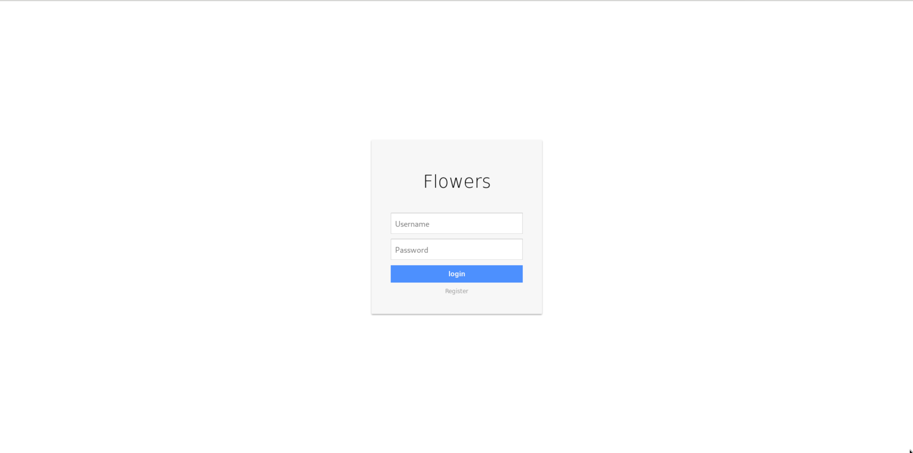
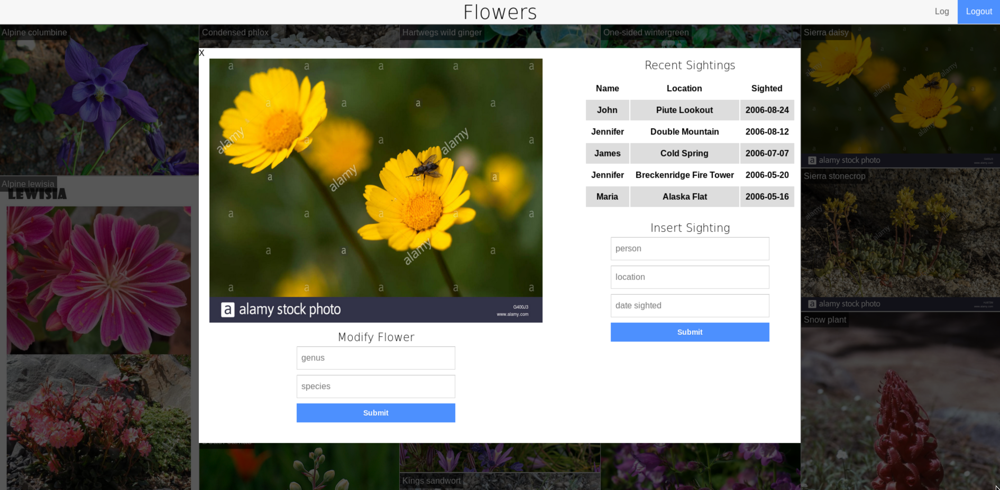

# Flowers Database

A final project with a jQuery-powered frontend and Flask with SQLite3 powered backend.

- Account registration
- Account Login
- Account sessions
- Search Google Images for flowers
- Display all flowers and names
- Modfiy flower properites
- Adding flower sightings
- Show 10-latest sightings
- Show database log

# Running
`python app.py`

Open favorite browser: `localhost:5000`


# Layout
```
├── app.py
├── database
│   └── flowers.db
├── flowers.db
├── README.md
├── requirements.txt
├── screenshots
│   ├── flowers.png
│   ├── login.png
│   └── modify.png
├── static
│   ├── flower_imgs
│   │   └── README.md
│   ├── login.html
│   ├── register.html
│   ├── style-app.css
│   └── style.css
├── templates
│   ├── flowers.html
│   └── log.html
└── video.flv
```

`app.py`: Flask backend and all SQLite3 calls

`templates/flowers.html`: contains frontend jQuery code for interfacing with backend, and displays a gallery

`templates/log.html`: calls for log from backend and displays it

`static/login.html`: a static login page that sends post request to `app.py` for login

`static/register.html`: a static register page which sends post request to `app.py` for registration

`database/flowers.db`: an unedited database file

`flowers.db`: a copy of original, which is to be modified when running app

`static/flower_imgs`: stores all images from Google

`static/*.css`: contains css for login/registration/flowers page

# Screenshots
[Video](./video.flv)





